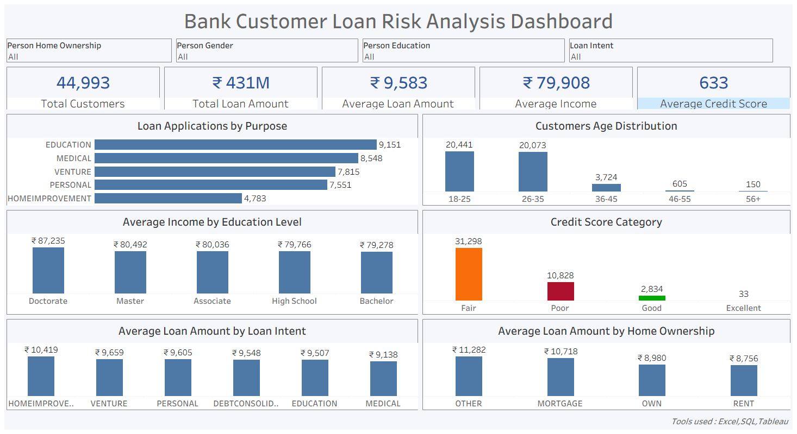

#  Bank Customer Loan Risk Analysis | SQL & Tableau Analytics

##  Project Overview

This project analyzes bank loan applications to understand customer demographics, loan purposes, income patterns, home ownership, and credit risk.

The analysis was performed using SQL for data exploration and Tableau for interactive dashboard visualization.

---

##  Business Objective

The objective of this project is to help the bank:

- Understand customer demographics
- Analyze loan application patterns
- Evaluate customer credit quality
- Identify income trends across education levels
- Support better lending decisions

---

##  Tools Used

- SQL Server
- Tableau
- Microsoft Excel

---

## Skills Demonstrated

- SQL Joins
- Common Table Expressions (CTEs)
- Window Functions
- Aggregate Functions
- Data Cleaning
- Data Visualization
- Dashboard Design
- Business Analysis
  
---

##  Project Workflow

1. Data Collection
2. Data Cleaning using Excel
3. Data Exploration using SQL Server
4. KPI Calculation
5. Dashboard Development using Tableau
6. Business Insights Generation

---

##  Dashboard KPIs

- Total Customers
- Total Loan Amount
- Average Loan Amount
- Average Income
- Average Credit Score

---

##  Dashboard Features

- Loan Applications by Purpose
- Customer Age Distribution
- Average Income by Education Level
- Credit Score Category Analysis
- Average Loan Amount by Loan Purpose
- Average Loan Amount by Home Ownership

---

##  Files Included

- SQL_Queries.sql
- Cleaned_Dataset.csv
- Bank_Loan_Risk_Analysis.twbx
- Dashboard.png

---

##  Key Insights

- Most loan applications are for Education and Medical purposes.
- Customers aged 18–35 account for the majority of applications.
- Doctorate holders have the highest average income.
- Most customers fall into the Fair credit score category.
- Home ownership shows differences in average loan amounts.

---

##  Author
Farha Fatima
-GitHub:
https://github.com/Farha-Fatima27
